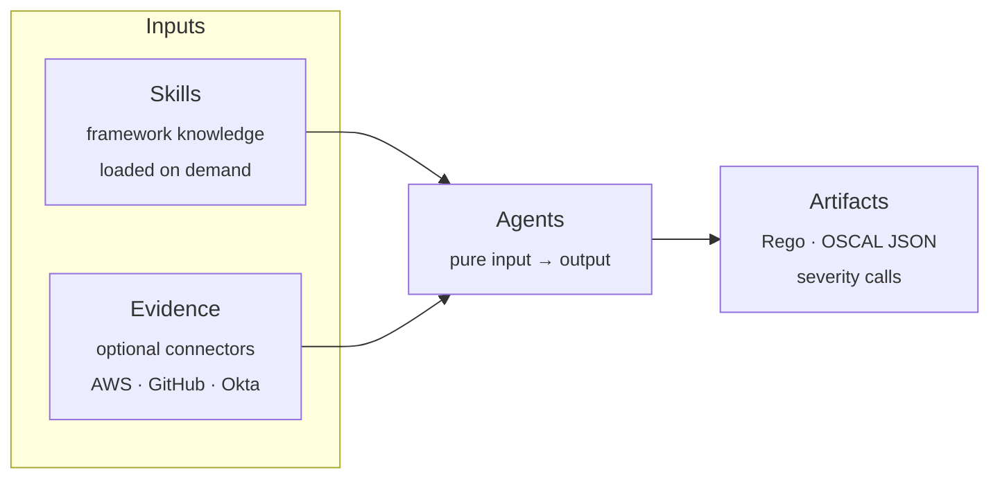

<div align="center">

# compliance-as-code

**Engineer-voice agent skills, agents, and reference connectors for compliance work.**

*For the people instrumenting the systems — not the people writing the report.*

**SOC 2** · **ISO 27001** · **NIST 800-53**

[](https://github.com/grcwarlock/compliance-as-code/actions/workflows/ci.yml)
[](https://github.com/grcwarlock/compliance-as-code/releases)
[](LICENSE)
[](https://github.com/grcwarlock/compliance-as-code/commits/main)
[](CONTRIBUTING.md)

</div>

---

## Quick start

```bash
git clone https://github.com/grcwarlock/compliance-as-code.git
cd compliance-as-code
./scripts/install.sh --target /path/to/your/agent/skills/dir
```

Restart your agent runtime. Done.

> **Want to use an agent outside any runtime?**
>
> ```bash
> pip install -r scripts/requirements-runner.txt
> LLM_PROVIDER=openai LLM_MODEL=gpt-4o \
>   python scripts/run-agent.py oscal-emitter \
>     --input agents/oscal-emitter/examples/input-assessment-notes.md
> ```
>
> Works with any LLM LiteLLM supports — OpenAI, Ollama (local), Gemini, Mistral, Bedrock, Vertex AI, Groq, Cohere, and more. No specific provider's API key is required to use this repo.

---

## What this is

A small, focused kit that turns any LLM-aware terminal into a competent compliance collaborator — for three frameworks engineers actually ship against.

|  | This repo | Most compliance content |
|---|---|---|
| **Audience** | People instrumenting systems | Auditors preparing reports |
| **Voice** | Event types, evidence shapes, continuous controls | Policies, committees, "the auditor expects..." |
| **Install** | `./install.sh --target <path>` | PDF in a shared drive |
| **Output** | Rego policies, OSCAL JSON, severity calls | Screenshots in a PowerPoint |
| **License** | MIT | Usually none |
| **Runtime lock-in** | None | Usually one vendor |

---

## How it flows



---

## What's inside

### Skills — framework knowledge that loads on demand

| Skill | Core knowledge |
|---|---|
| [`soc-2`](skills/soc-2/SKILL.md) | Trust Services Criteria engineer's view · evidence-as-code · continuous controls · Type 1 vs Type 2 |
| [`iso-27001`](skills/iso-27001/SKILL.md) | Annex A 2022 · ISMS-as-code · risk register schema · evidence pipelines |
| [`nist-800-53`](skills/nist-800-53/SKILL.md) | 20 control families · baselines and tailoring · inheritance · OSCAL emission |

Each ships a short `SKILL.md` plus four load-on-demand reference docs and one worked example.

### Agents — prompts that produce concrete artifacts

| Agent | Input → Output |
|---|---|
| [`opa-policy-author`](agents/opa-policy-author/AGENT.md) | Control description + evidence shape → Rego policy with deny rules |
| [`oscal-emitter`](agents/oscal-emitter/AGENT.md) | Markdown assessment notes → OSCAL Assessment Results JSON |
| [`poam-classifier`](agents/poam-classifier/AGENT.md) | Deficiency + context → PCAOB severity (deficiency / SD / MW) with reasoning |

All three are pure input → output, offline-verifiable, and work with any LLM provider.

### Connectors — optional, standalone evidence emitters

| Connector | Emits | SDK |
|---|---|---|
| [`aws-iam`](connectors/aws-iam/README.md) | IAM user snapshots · MFA · console · access-key state | boto3 |
| [`github`](connectors/github/README.md) | Branch protection rules · org admin membership | PyGithub |
| [`okta`](connectors/okta/README.md) | User MFA factors · privileged group membership | requests |

Single-file Python scripts, read-only, least-privilege. **Skills and agents work without any connector installed.** Each connector's README documents its required scopes and IAM minimums.

---

## Why this exists

Most compliance content is written for auditors. It tells you what an auditor expects to see, what evidence to collect, what the control IDs mean. Useful — **once a year**.

The other 364 days, someone has to actually instrument the systems, write the policies, emit the artifacts, and keep it all running. That is an engineering job. Engineering jobs need engineering tools.

---

## Usage examples

Prompts that activate a skill:

```text
What evidence does an auditor expect for SOC 2 CC6.1, and how would I make it continuous?
```

```text
Walk me through scoping ISO 27001 Annex A controls for a 50-person SaaS that already has SOC 2.
```

```text
Map our AWS IAM controls to NIST SP 800-53 Rev. 5 AC family at the moderate baseline.
```

Running an agent directly:

```bash
LLM_PROVIDER=openai LLM_MODEL=gpt-4o            python scripts/run-agent.py oscal-emitter --input notes.md
LLM_PROVIDER=ollama LLM_MODEL=llama3            python scripts/run-agent.py opa-policy-author --input control.md
LLM_PROVIDER=gemini LLM_MODEL=gemini-2.0-flash  python scripts/run-agent.py poam-classifier --input deficiency.md
```

---

<details>
<summary><strong>How agent skills work (click to expand)</strong></summary>

A skill is a directory containing a `SKILL.md` file with YAML frontmatter — at minimum `name`, `description`, and `when_to_use`. Compatible agent runtimes auto-discover skills in a configured directory and activate them when conversation matches the description. The `SKILL.md` stays short; longer reference material lives in `references/` and gets loaded on demand.

```text
skills/soc-2/
  SKILL.md              # frontmatter + short body, links to references
  examples/example.md
  references/
    trust-services-criteria-engineer-view.md
    evidence-as-code-patterns.md
    continuous-monitoring-patterns.md
    type-1-vs-type-2-for-engineers.md
```

Agents follow the same shape (`AGENT.md` instead of `SKILL.md`, plus a `prompt.md`). This file format is vendor-neutral; any agent runtime that respects the frontmatter contract can load these skills.

</details>

<details>
<summary><strong>What this repo will not become (click to expand)</strong></summary>

Scope discipline matters more than scope expansion. This repo will not add:

- A connector framework, plugin system, or shared base class. Each connector is a single independent file by design.
- Agents that require a database, persistent state, or live cloud credentials at runtime.
- Skills that promote a specific commercial product.
- A web UI, dashboard, scheduler, or orchestrator — those are a different product.
- Reference docs lifted from copyrighted material. Cite the standard; write fresh prose.

If you need those things, fork and build them. This repo stays a kit.

</details>

---

## Contributing

PRs welcome — new frameworks, improved references, better agents, more connectors, bug fixes.

1. Read [CONTRIBUTING.md](CONTRIBUTING.md).
2. Run `python scripts/validate.py` and `python scripts/eval.py`.
3. Open the PR.

---

## Roadmap

| Version | Status | Contents |
|---|---|---|
| **v0.1** | **shipped** | SOC 2, ISO 27001, NIST 800-53 skills · `opa-policy-author`, `oscal-emitter`, `poam-classifier` agents · AWS IAM, GitHub, Okta connectors · offline eval harness |
| **v0.2** | planned | PCI DSS, HIPAA, GDPR, EU AI Act skills · additional connectors (GCP, Azure, Snowflake) · plugin manifest for one-command install via compatible agent runtimes · end-to-end integration examples · `--with-llm` mode in the eval harness |
| **v0.3** | planned | Cross-framework crosswalk skill · real benchmark numbers for agent output quality across providers |

---

## License

MIT &copy; 2026. See [LICENSE](LICENSE). Community contributions are licensed under MIT by their authors.

<div align="center">

Built on the public work of **NIST** · **ISO/IEC** · **AICPA** · **Open Policy Agent** · **OSCAL working group**.

</div>
